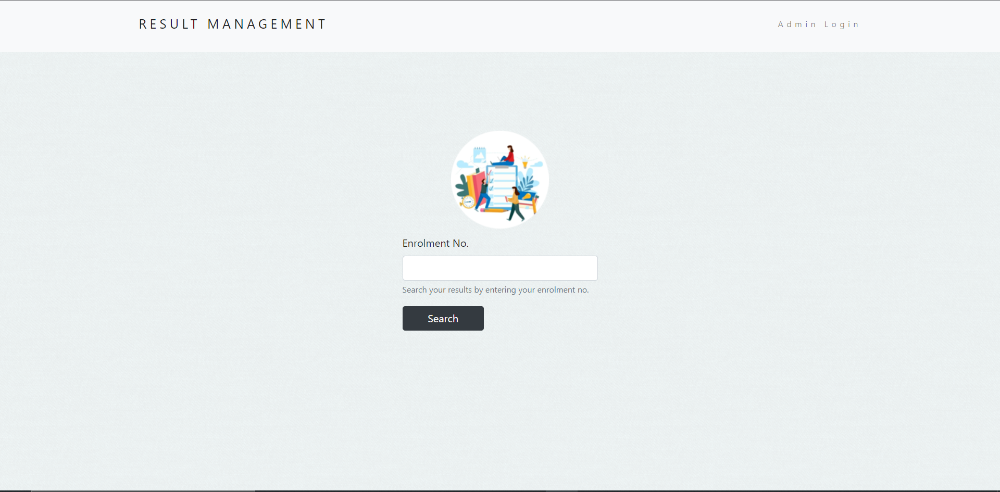
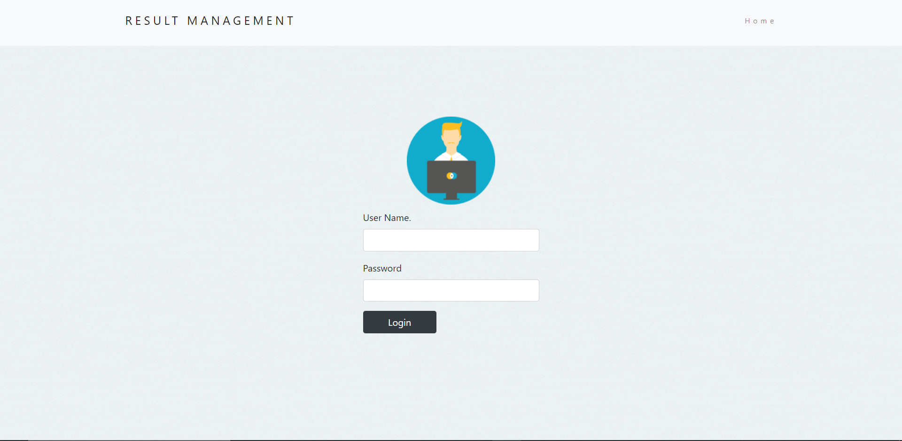
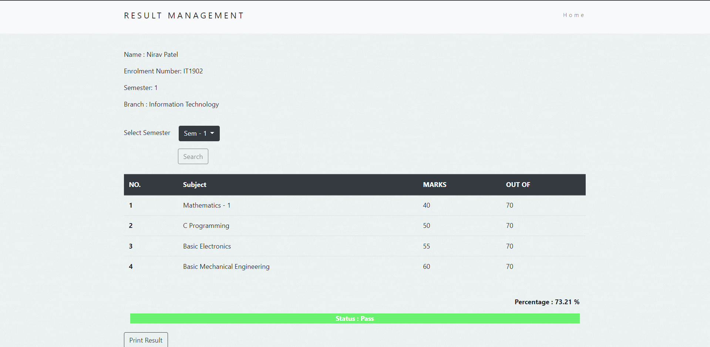
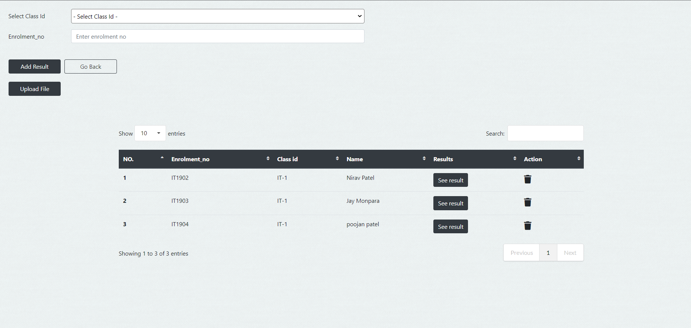
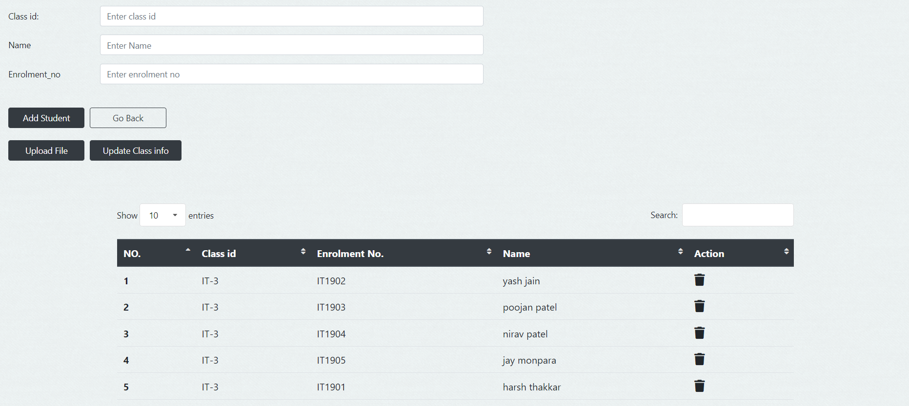
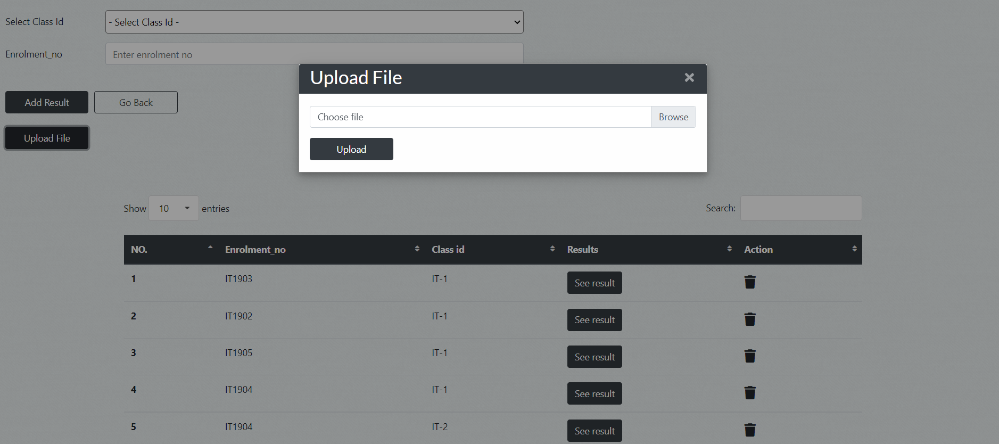

# Result Management System

A web app for managing college results.

## Built with

- [node](https://nodejs.org/en/)
- [express](https://expressjs.com/)
- [bootstrap](https://getbootstrap.com/)

## Set up your local environment

fork [this](https://github.com/YashJain2409/ResultManagementSystem) repository

Clone the project

```bash
  git clone https://link-to-project
```

Go to the project directory

```bash
  cd my-project
```

Install dependencies

```bash
  npm install
```

Start the server

```bash
   node app.js
```

Credentials for admin

```bash
   username : admin
   password : admin
```

## ScreenShots








